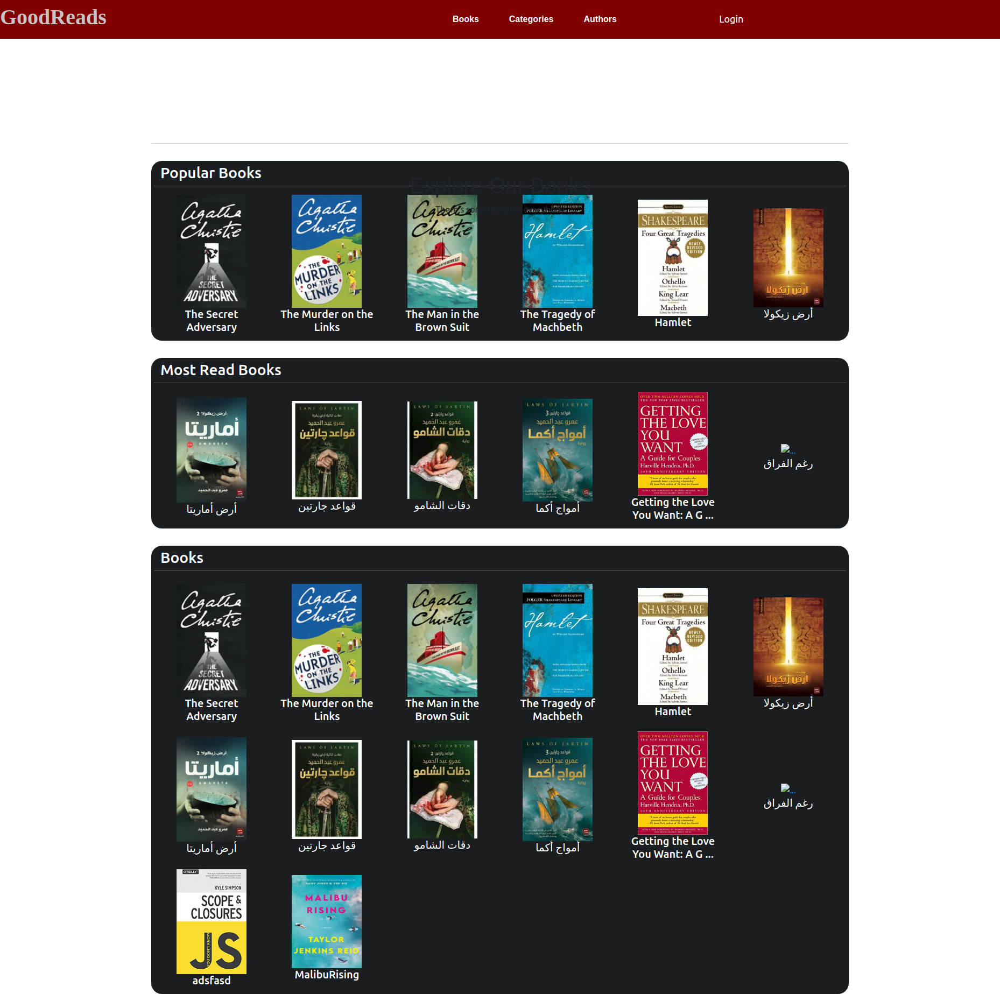
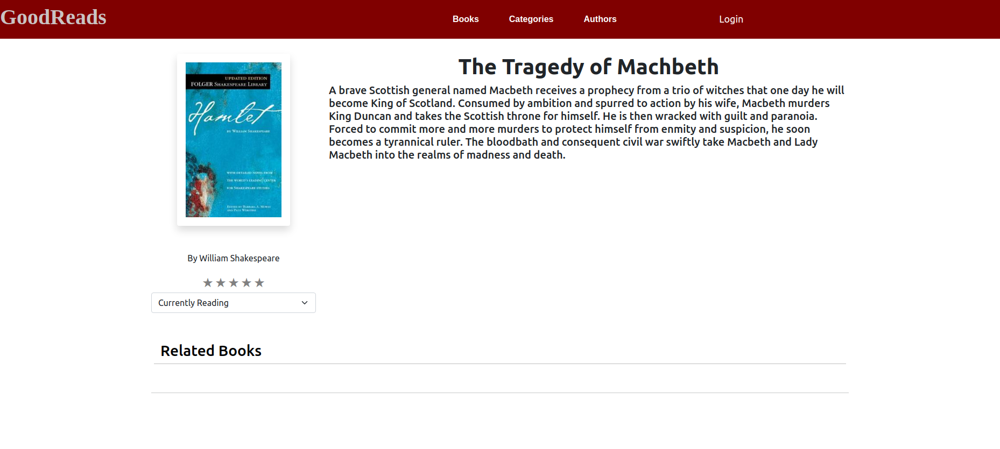
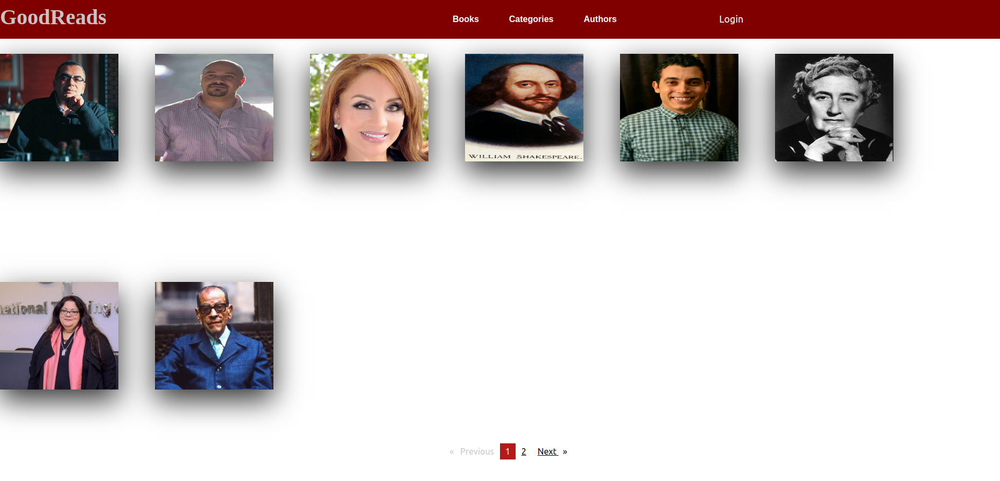
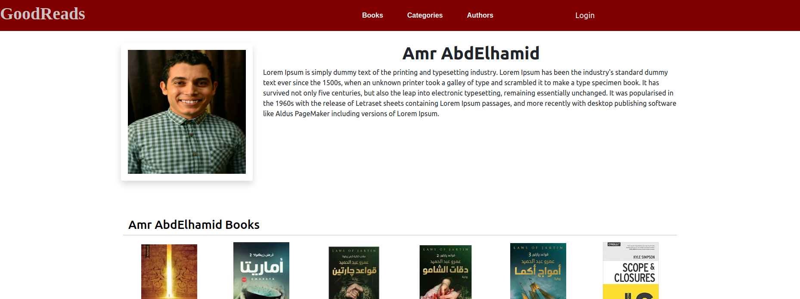
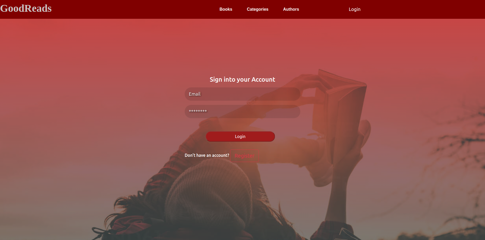
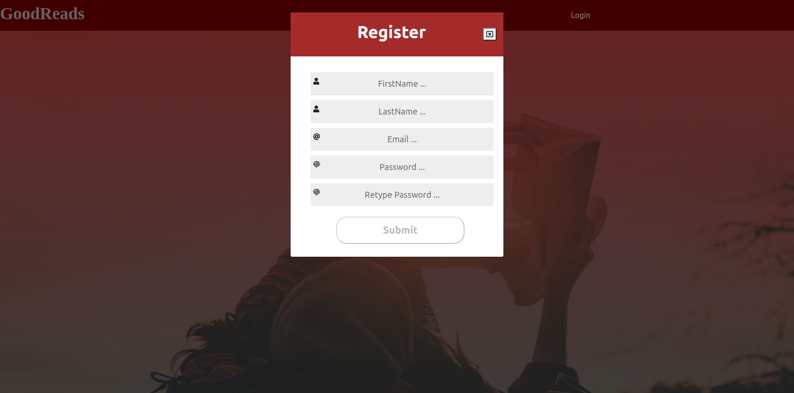

# Good Reads Client

Redesign For Good Reads Website Using angular.
Find and read more books you'll love, and keep track of the books you want to read.

# Run the application

Go to application folder then

1.cd GoodReadsClient.

2.npm start in terminal.

# Deployment Link

We deployed our application in AWS servers.

http://13.59.136.94:9000

## Landing Page

When you enter the website as a guest landing page will load for you to start browsing.

## Books Page

In this page 3 section

1.Popular books

2.Most Read Books

3.all Books

## Book Details

In book page you can see book name,summary,review and rating.
you can also add you review or add the book to your shelf after register and login on the website.

## Authors Page

This page view all authors.

## Author Details

You can access to more details about author.

## Login & Register Page

To use our application features you should register and login first.

Login Form

Registeration Form

